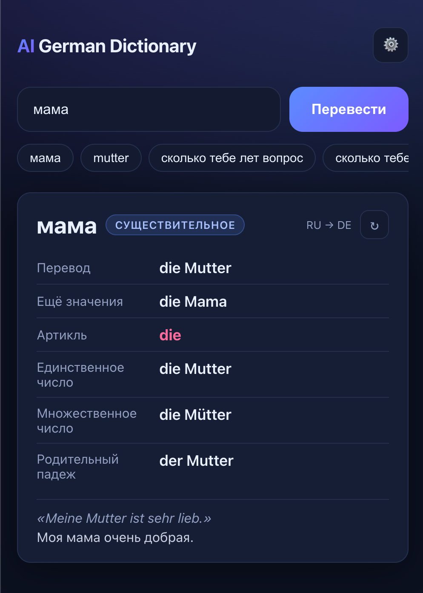
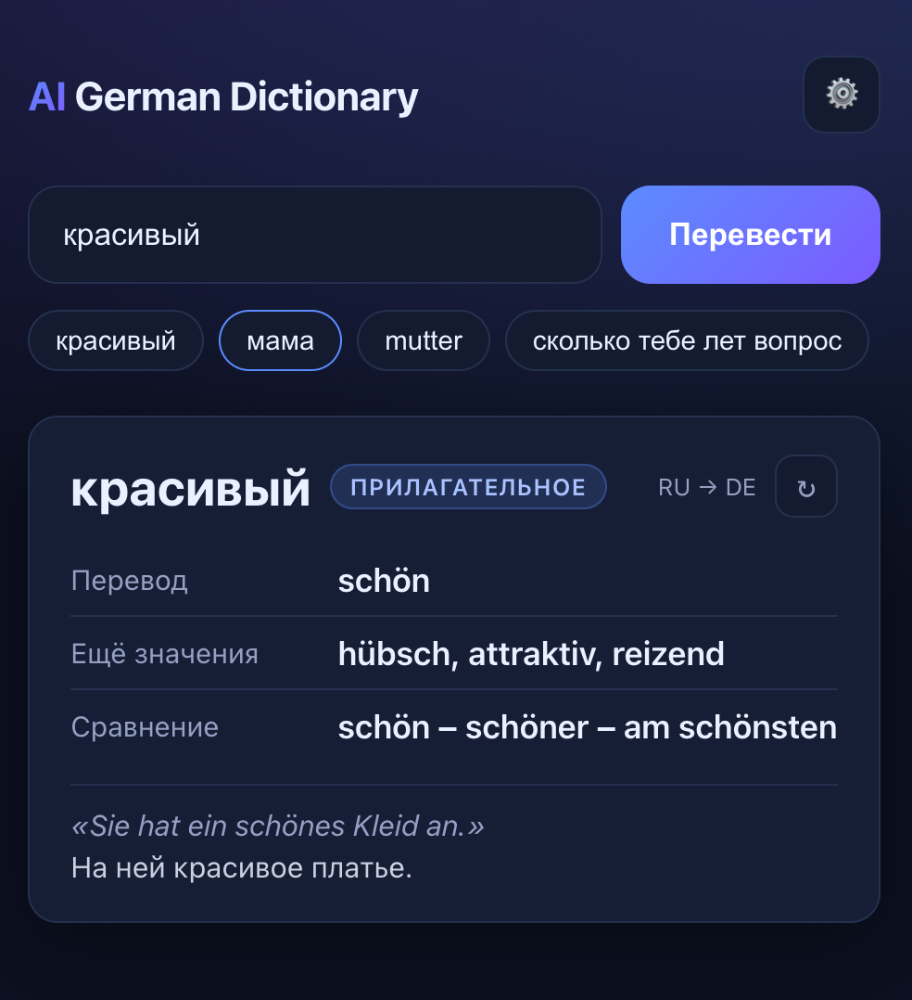
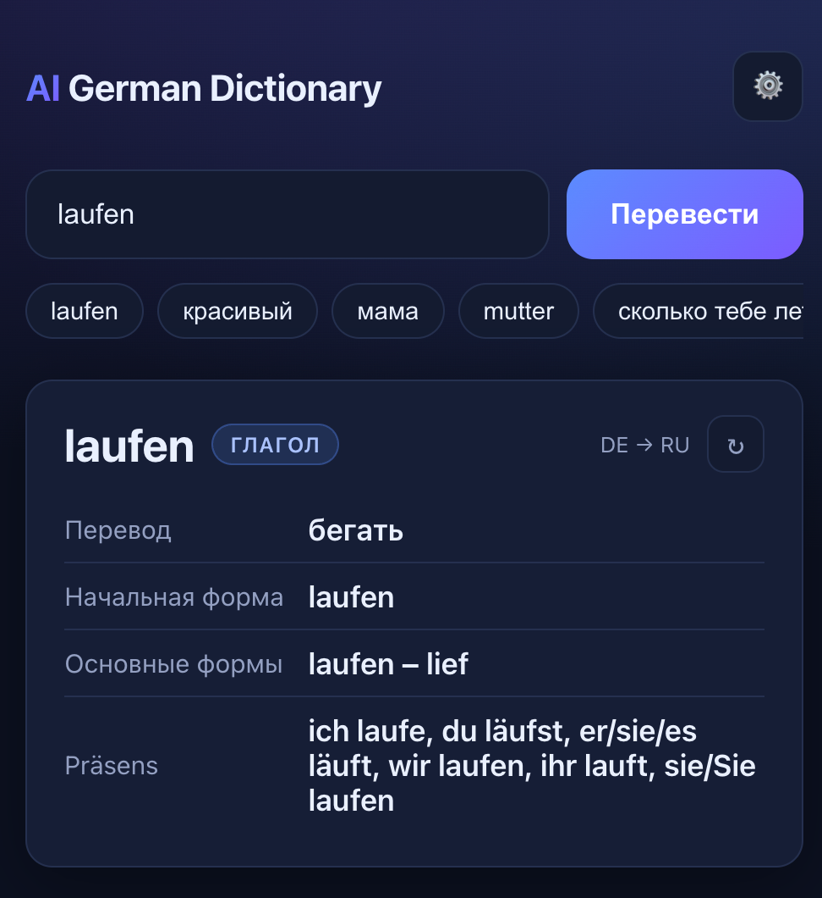
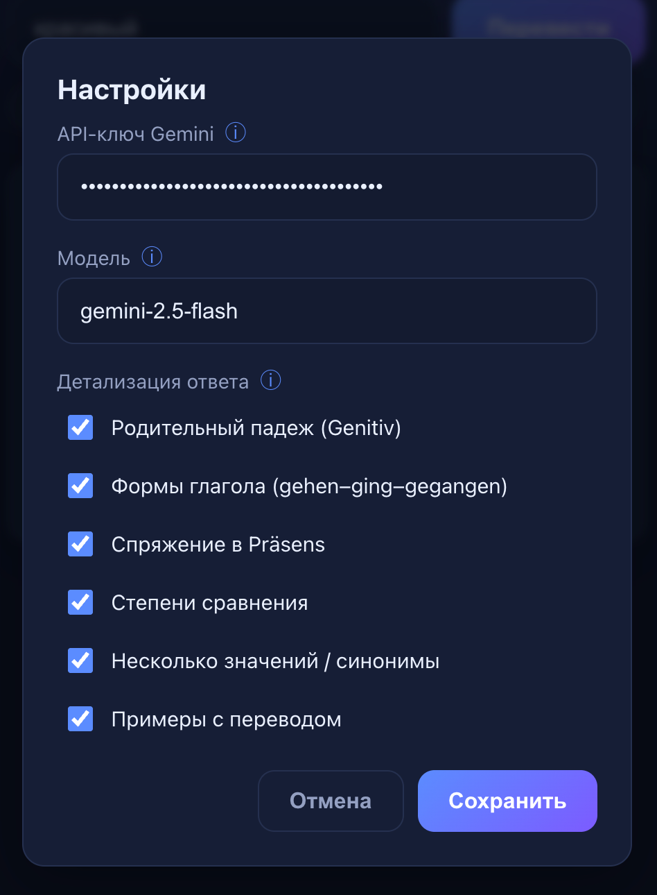

# AI German Dictionary

Устанавливаемое PWA-приложение (русско-немецкий словарь) на чистом HTML/CSS/JS.
Работает полностью на фронтенде, без бэкенда. Перевод и грамматику даёт **Gemini API**.

## Демо

| Существительное | Прилагательное |
|:---:|:---:|
|  |  |
| **Глагол** | **Настройки** |
|  |  |

## Возможности
- Ввод слова на русском или немецком — язык определяется автоматически.
- Перевод RU → DE и DE → RU.
- Существительные: артикль, единственное и множественное число.
- Глаголы: начальная форма (инфинитив).
- Прилагательные: перевод.
- Устанавливается как приложение (PWA), работает оффлайн (оболочка) и адаптивно.

## Запуск локально
Любой статический сервер, например:
```bash
python3 -m http.server 8080
```
Откройте http://localhost:8080

> Service Worker и установка PWA требуют `https://` или `localhost`.

## Деплой на GitHub Pages
1. Создайте репозиторий и залейте эти файлы в корень ветки.
2. **Settings → Pages → Build and deployment → Source: Deploy from a branch**.
3. Branch: `main`, папка `/ (root)` → Save.
4. Через минуту приложение будет доступно по адресу
   `https://<ваш-логин>.github.io/<имя-репозитория>/`.

Все пути относительные, поэтому работа из подпапки `/IAGerman/` поддерживается без изменений.

## API-ключ Gemini
Так как бэкенда нет, ключ нельзя зашить в код (он стал бы публичным).
При первом запуске приложение попросит ввести **ваш бесплатный ключ**:

1. Откройте https://aistudio.google.com/app/apikey
2. Нажмите **Create API key** (бесплатно).
3. Вставьте ключ — он сохранится только в `localStorage` вашего устройства.

Изменить ключ можно в любой момент кнопкой ⚙️.

Модель: `gemini-2.0-flash` (бесплатный тариф).
